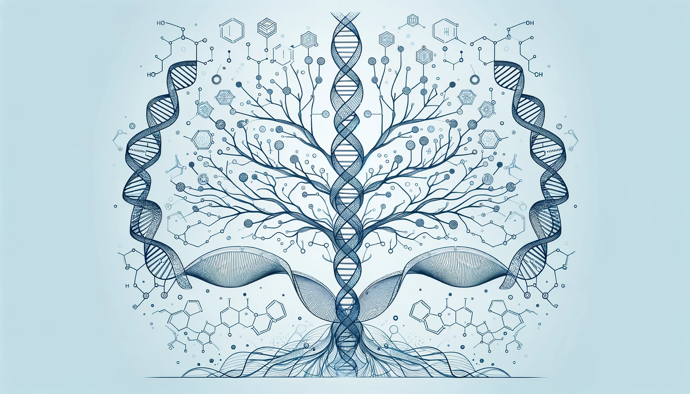

<h1 align="center">😎 Hi! I'm Longfu Xu</h1>

## About Me
Hello! I am a passionate **Biophysical and Biochemical Researcher**. My fascination lies in uncovering life's fundamental principles from a single-molecule perspective.

### Current Role
I am currently working as a **Postdoctoral Researcher** in Professor Gijs Wuite's laboratory at **Vrije Universiteit Amsterdam**. My primary focus is on exploring the intricate dance between DNA and proteins, a critical aspect of cellular function. I employ cutting-edge single-molecule manipulation and visualization techniques, aiming to decode these vital interactions.
### Future Role
I will be starting a new journey as a postdoc researcher in Prof. **Carlos Bustamante**'s laboratory at **University of California, Berkeley** since Feb.2024. 

### Academic Journey
My academic journey has been deeply influenced by my time during my doctoral research, under the guidance of **Professor Wuite**. This period was pivotal in shaping my research direction and interests.

#### Education
- **Ph.D.**: Conducted under Professor Gijs Wuite.
- **Master of Science**: Earned from the **University of the Chinese Academy of Sciences**. I had the privilege of studying under Professors Zhiguo Su and Yongdong Liu, focusing on the field of long-acting biopharmaceuticals. My research centered on innovative methods like PEGylation and the incorporation of albumin-binding domains.

### Research Interests
- Single-Molecule Biophysics
- DNA-Protein Interactions
- Biopharmaceuticals
- PEGylation Techniques
- DNA Packaging
---

"Unraveling the mysteries of life, one molecule at a time."
